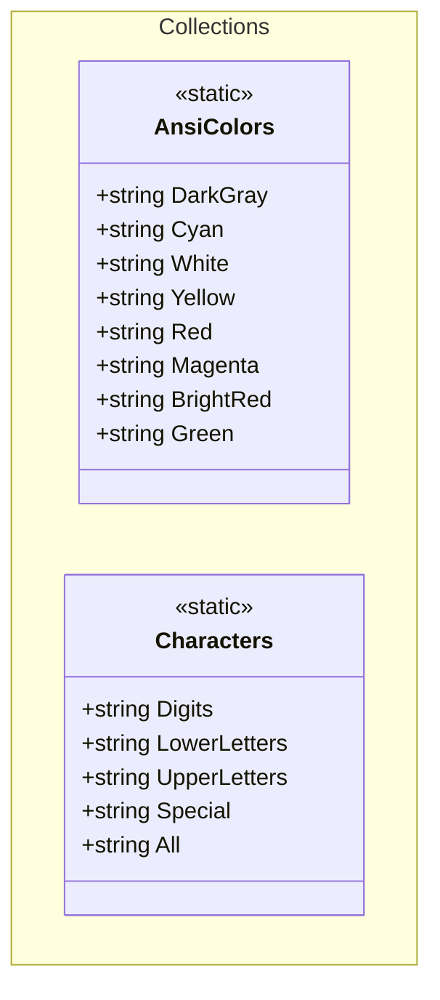
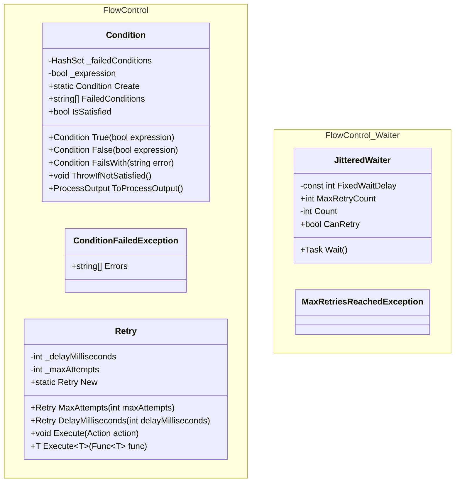
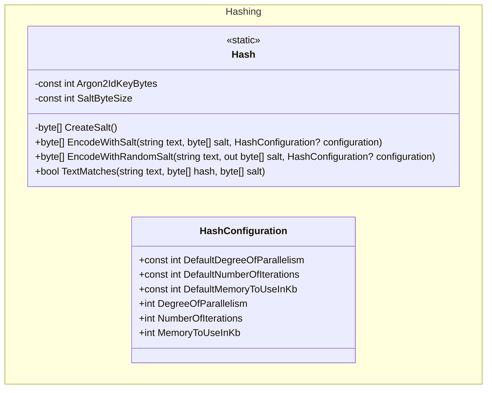
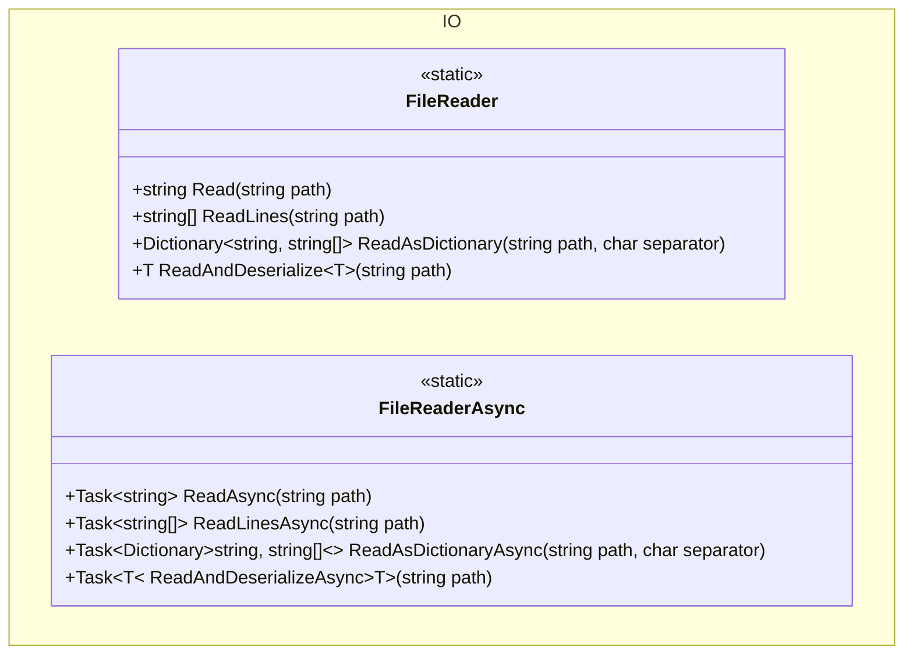
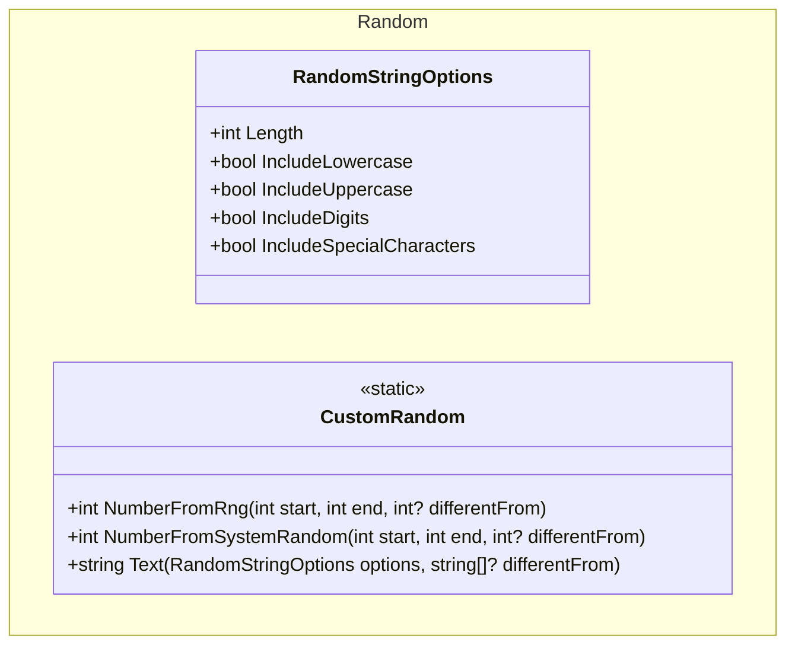
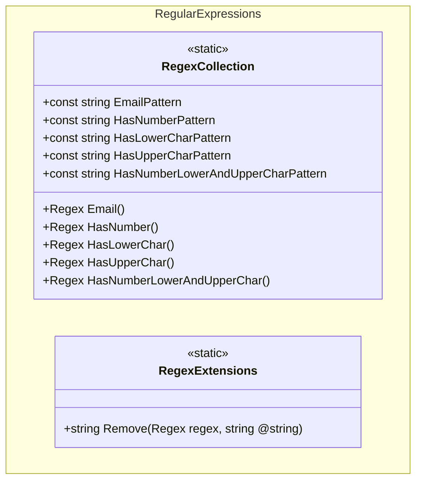

+++
title = 'Dotnet Util'
+++

# Dotnet Util

Utilities for common development tasks in .NET: flow control (conditions, retries and waiters), hashing (Argon2id), file I/O helpers, random values and strings, regex helpers, and small collections.

## Installation

- NuGet (recommended): publish or consume the package when available.
  - Package ID (assumed): `ArturRios.Util`.
  - Add to your project:
    - dotnet CLI: `dotnet add package ArturRios.Util`
    - Or reference locally:
      - Add a project reference to `src/ArturRios.Util.csproj` in your `.csproj`:

        ```xml
        <ItemGroup>
          <ProjectReference Include="..\src\ArturRios.Util.csproj" />
        </ItemGroup>
        ```

## Quickstart

- Collections
  - ANSI colors: `Console.WriteLine($"{ArturRios.Util.Collections.AnsiColors.Green}Success\x1b[0m");`
  - Character pools: `Characters.Digits + Characters.UpperLetters`
- FlowControl
  - Condition:

    ```csharp
    using ArturRios.Util.FlowControl;
    Condition.Create
      .True(user is not null).FailsWith("User is required")
      .True(emailValid).FailsWith("Invalid email")
      .ThrowIfNotSatisfied();
    ```

  - Retry:

    ```csharp
    using ArturRios.Util.FlowControl;
    Retry.New.MaxAttempts(3).DelayMilliseconds(200).Execute(() => DoFragileWork());
    var result = Retry.New.MaxAttempts(5).Execute(() => Compute());
    ```

  - Jittered waiter:

    ```csharp
    using ArturRios.Util.FlowControl.Waiter;
    var waiter = new JitteredWaiter(maxRetryCount: 5);
    while (waiter.CanRetry)
    {
        try { await TryOperationAsync(); break; }
        catch { await waiter.Wait(); }
    }
    ```

- Hashing (Argon2id)

  ```csharp
  using ArturRios.Util.Hashing;
  var hash = Hash.EncodeWithRandomSalt("secret", out var salt);
  var ok = Hash.TextMatches("secret", hash, salt);
  ```

- IO

  ```csharp
  using ArturRios.Util.IO;
  var text = FileReader.Read(path);
  var lines = FileReader.ReadLines(path);
  var dict = FileReader.ReadAsDictionary(path, ',');
  var obj = FileReader.ReadAndDeserialize<MyType>(jsonPath);
  // Async variants available on FileReaderAsync
  ```

- Random

  ```csharp
  using ArturRios.Util.Random;
  var n1 = CustomRandom.NumberFromRng(1, 10);
  var n2 = CustomRandom.NumberFromSystemRandom(0, 100, differentFrom: 42);
  var pwd = CustomRandom.Text(new RandomStringOptions { Length = 16, IncludeSpecialCharacters = true });
  ```

- RegularExpressions

  ```csharp
  using ArturRios.Util.RegularExpressions;
  var isEmail = RegexCollection.Email().IsMatch("john@doe.com");
  var stripped = RegexCollection.HasNumber().Remove("abc123def"); // -> "abcdef"
  ```

---

## Folder to Features Map

- `src/Collections`: ANSI color codes and character sets.
- `src/FlowControl`: condition evaluation, simple retry, jittered waiter.
- `src/Hashing`: Argon2id hashing helpers and configuration.
- `src/IO`: file reading (text, lines, CSV-like to dictionary) and JSON deserialization, sync and async.
- `src/Random`: random integers and constrained random string generation.
- `src/RegularExpressions`: common regex patterns and extensions.

---

## Collections

Features:

- `AnsiColors`: constants for console foreground colors via ANSI escape codes.
- `Characters`: constants for digits, lower/upper letters, special characters, and union `All`.

Mermaid class diagram:



---

## FlowControl

Features:

- `Condition`: fluent condition aggregator with failure messages; can throw or convert to process output.
- `Retry`: simple retry utility with max attempts and fixed delay; supports `Action` and `Func<T>`.
- `Waiter/JitteredWaiter`: exponential backoff with jitter; guards with `CanRetry` and throws `MaxRetriesReachedException` when exceeded.
- `Waiter/MaxRetriesReachedException`: custom exception for retry exhaustion.

Mermaid class diagram:



---

## Hashing

Features:

- `Hash`: Argon2id helpers to encode with provided or random salt, and verify matches.
- `HashConfiguration`: configurable cost parameters: degree of parallelism, iterations, memory in KB.

Mermaid class diagram:



---

## IO

Features:

- `FileReader` (sync): read text, lines, CSV-like to dictionary, JSON to object.
- `FileReaderAsync` (async): same operations asynchronously.

Mermaid class diagram:



---

## Random

Features:

- `CustomRandom`: random integers via RNG or System.Random, and constrained random strings.
- `RandomStringOptions`: options for length and inclusion of lowercase, uppercase, digits, and special characters.

Mermaid class diagram:



---

## RegularExpressions

Features:

- `RegexCollection`: common patterns with source-generated compiled regex methods.
  - Email, has number, has lower, has upper, has number+lower+upper.
- `RegexExtensions`: convenience extension to remove all matches via `Regex.Remove`.

Mermaid class diagram:



---

## Contributing

- Tests live under `tests/ArturRios.Util.Tests`. Please add tests for new features and run them before submitting PRs.
- Follow typical .NET coding conventions and keep public APIs documented with XML comments.

## Legal Details

This project is licensed under the [MIT License](https://en.wikipedia.org/wiki/MIT_License). A copy of the license is available at [LICENSE](https://github.com/artur-rios/dotnet-util/blob/main/LICENSE).

---
