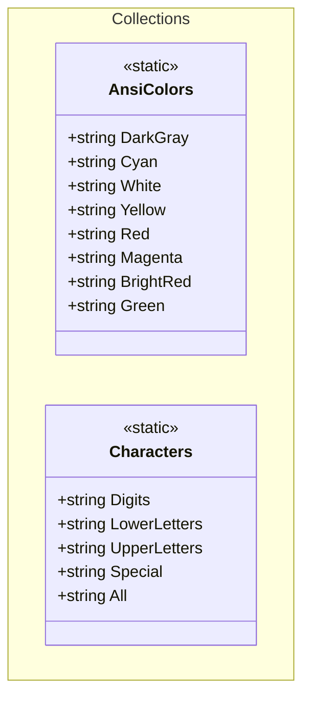

## Features

- `AnsiColors`: static class with ANSI escape code string constants for console foreground colors (DarkGray, Cyan, White, Yellow, Red, Magenta, BrightRed, Green).
- `Characters`: static class with string constants for character pools — digits, lowercase letters, uppercase letters, special characters, and the union `All`.

## Class Diagram



## Usage

### ANSI Colors

Wrap text in a color constant and reset with `\x1b[0m`:

```csharp
using ArturRios.Util.Collections;

Console.WriteLine($"{AnsiColors.Green}Success!\x1b[0m");
Console.WriteLine($"{AnsiColors.Red}Error: something went wrong.\x1b[0m");
Console.WriteLine($"{AnsiColors.Yellow}Warning: disk usage is high.\x1b[0m");
Console.WriteLine($"{AnsiColors.Cyan}Info: process started.\x1b[0m");
```

### Character Pools

Combine pools with string concatenation:

```csharp
using ArturRios.Util.Collections;

string alphanumeric = Characters.Digits + Characters.LowerLetters + Characters.UpperLetters;
bool isDigit = Characters.Digits.Contains('5'); // true

// Use Characters.All for the widest possible pool
string fullPool = Characters.All;
```
