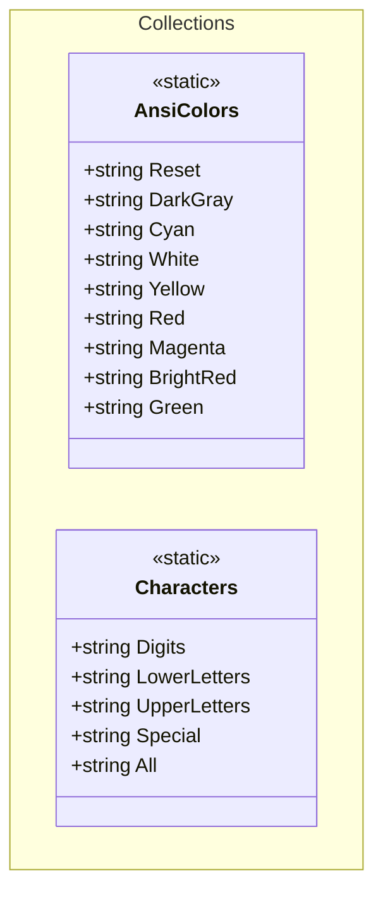

## Features

- `AnsiColors`: static class with ANSI escape code string constants for console foreground colors (DarkGray, Cyan, White, Yellow, Red, Magenta, BrightRed, Green) plus `Reset`, which returns the terminal to its default colors.
- `Characters`: static class with string constants for character pools — digits, lowercase letters, uppercase letters, special characters, and the union `All`. `Special` is the complete set of ASCII punctuation, so a character counts as special exactly when it is printable ASCII and not alphanumeric.

## Class Diagram


```mermaid
classDiagram
    namespace Collections {
        class AnsiColors {
            <<static>>
            +string Reset
            +string DarkGray
            +string Cyan
            +string White
            +string Yellow
            +string Red
            +string Magenta
            +string BrightRed
            +string Green
        }
        class Characters {
            <<static>>
            +string Digits
            +string LowerLetters
            +string UpperLetters
            +string Special
            +string All
        }
    }
```

## Usage

### ANSI Colors

Wrap text in a color constant and reset with `AnsiColors.Reset`:

```csharp
using ArturRios.Util.Collections;

Console.WriteLine($"{AnsiColors.Green}Success!{AnsiColors.Reset}");
Console.WriteLine($"{AnsiColors.Red}Error: something went wrong.{AnsiColors.Reset}");
Console.WriteLine($"{AnsiColors.Yellow}Warning: disk usage is high.{AnsiColors.Reset}");
Console.WriteLine($"{AnsiColors.Cyan}Info: process started.{AnsiColors.Reset}");
```

### Character Pools

Combine pools with string concatenation:

```csharp
using ArturRios.Util.Collections;

string alphanumeric = Characters.Digits + Characters.LowerLetters + Characters.UpperLetters;
bool isDigit = Characters.Digits.Contains('5'); // true

// Use Characters.All for the widest possible pool
string fullPool = Characters.All;
```
