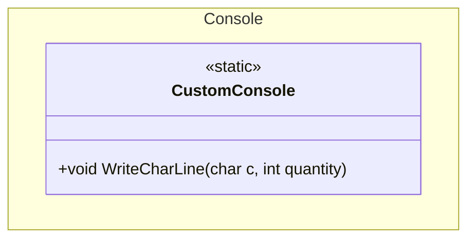

## Features

- `CustomConsole`: static helpers for writing formatted output to the system console — currently a separator line built from a single repeated character.

## Class Diagram



## Usage

### Write a separator line

```csharp
using ArturRios.Util.Console;

// Defaults: 100 dashes
CustomConsole.WriteCharLine();
// ----------------------------------------------------------------------------------------------------
```

### Choose the character and the length

```csharp
CustomConsole.WriteCharLine('=', 40);
// ========================================

CustomConsole.WriteCharLine('*');   // 100 asterisks
CustomConsole.WriteCharLine('-', 0); // empty line
```

A negative `quantity` throws `ArgumentOutOfRangeException`.
