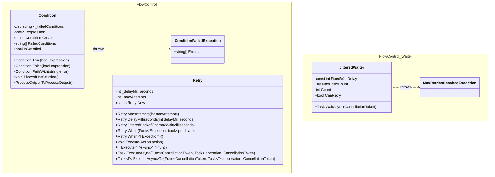

## Features

- `Condition`: fluent condition aggregator; collects failure messages in order — repeats included — and can throw `ConditionFailedException` or convert to a process output. `FailsWith` throws `InvalidOperationException` when no `True`/`False` precedes it.
- `ConditionFailedException`: exception carrying all collected error messages as `string[]`.
- `Retry`: simple retry with configurable max attempts and fixed delay; supports `Action`, `Func<T>` and the asynchronous `ExecuteAsync` overloads, a `When` predicate to restrict which exceptions are retried, and `JitteredBackoff` to space attempts with the same exponential-plus-jitter schedule as `JitteredWaiter`. `MaxAttempts(n)` runs the operation at most `n` times in total, and a configured instance is reusable.
- `JitteredWaiter`: exponential backoff with jitter, capped at `maxWaitMilliseconds` (30 s by default); `WaitAsync` accepts a `CancellationToken`, exposes `CanRetry` and throws `MaxRetriesReachedException` when retries are exhausted.
- `MaxRetriesReachedException`: exception thrown when `JitteredWaiter` exceeds its retry limit.

## Class Diagram



## Usage

### Condition

Chain boolean assertions — all failures are collected before throwing:

```csharp
using ArturRios.Util.FlowControl;

Condition.Create
    .True(user is not null).FailsWith("User is required")
    .True(emailValid).FailsWith("Invalid email format")
    .False(string.IsNullOrEmpty(username)).FailsWith("Username cannot be empty")
    .ThrowIfNotSatisfied();
```

Convert to a process output instead of throwing:

```csharp
var result = Condition.Create
    .True(age >= 18).FailsWith("Must be 18 or older")
    .ToProcessOutput();

if (!result.Success)
    Console.WriteLine(string.Join(", ", result.Errors));
```

### Retry

Retry a void action:

```csharp
using ArturRios.Util.FlowControl;

Retry.New
    .MaxAttempts(3)
    .DelayMilliseconds(200)
    .Execute(() => SendEmail(recipient));
```

Retry a function that returns a value:

```csharp
var data = Retry.New
    .MaxAttempts(5)
    .DelayMilliseconds(500)
    .Execute(() => FetchDataFromApi());
```

### JitteredWaiter

Use in a polling or retry loop with exponential backoff:

```csharp
using ArturRios.Util.FlowControl.Waiter;

var waiter = new JitteredWaiter(maxRetryCount: 5);

while (waiter.CanRetry)
{
    try
    {
        await TryOperationAsync();
        break;
    }
    catch (TransientException)
    {
        await waiter.WaitAsync();
    }
}
```
