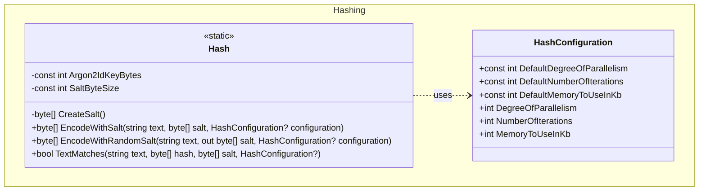

## Features

- `Hash`: static helpers for Argon2id password hashing — encode with a provided or randomly generated salt, and verify plaintext against a stored hash. Verification is constant time and accepts the same optional `HashConfiguration` used to produce the hash, so non-default cost parameters can be verified. Salts must be at least 8 bytes.
- `HashConfiguration`: configures Argon2id cost parameters — degree of parallelism, number of iterations, and memory usage in KB; each must be at least 1. The defaults are deliberately expensive (600 MB across 16 lanes per hash), which suits a login path but not a service hashing many secrets at once. Changing them invalidates existing hashes.

## Class Diagram



## Usage

### Hash a password with a random salt

```csharp
using ArturRios.Util.Hashing;

// Encode — store both hash and salt
byte[] hash = Hash.EncodeWithRandomSalt("my-secret-password", out byte[] salt);

// Verify later
bool matches = Hash.TextMatches("my-secret-password", hash, salt); // true
bool wrong   = Hash.TextMatches("wrong-password",     hash, salt); // false
```

### Hash with a known salt

```csharp
byte[] salt = GetSaltFromStorage();
byte[] hash = Hash.EncodeWithSalt("my-secret-password", salt);
```

### Custom cost parameters

```csharp
var config = new HashConfiguration
{
    DegreeOfParallelism = 4,
    NumberOfIterations  = 3,
    MemoryToUseInKb     = 65536
};

byte[] hash = Hash.EncodeWithRandomSalt("my-secret-password", out byte[] salt, config);
```
