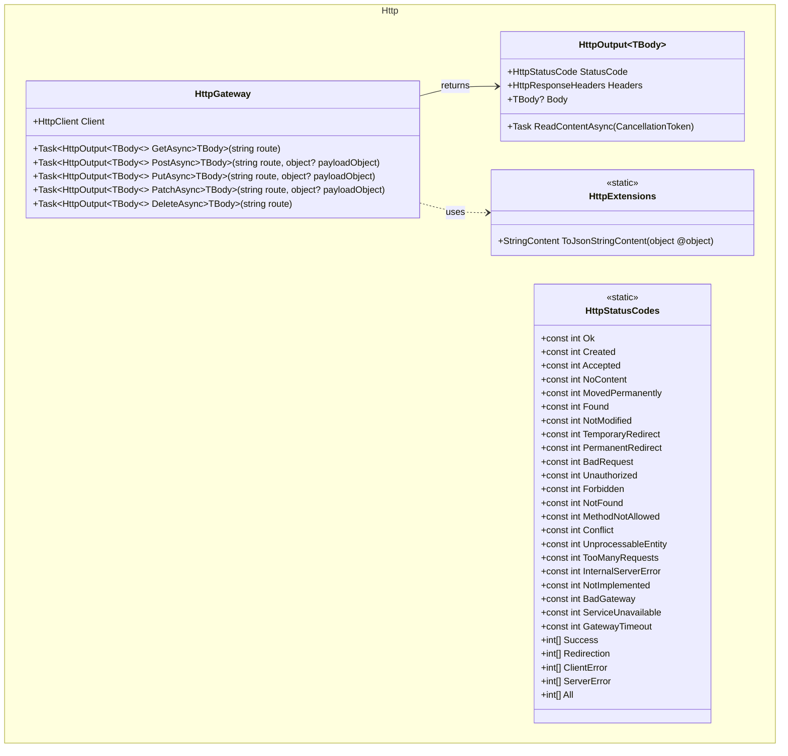

## Features

- `HttpGateway`: wraps `HttpClient` with typed async methods for GET, POST, PUT, PATCH, and DELETE. Each takes a `CancellationToken`, buffers the response body into an `HttpOutput<TBody>`, and disposes the underlying `HttpResponseMessage` before returning.
- `HttpOutput<TBody>`: typed HTTP response container carrying the status code, response and content headers, the raw body text, an `IsSuccess` flag, and the deserialized body. A payload that cannot be bound to `TBody` — malformed JSON, an array where an object was expected, an HTML error page — leaves `Body` at its default rather than throwing.
- `HttpExtensions`: generic extension providing `ToJsonStringContent()` to serialize a payload into a `StringContent` suitable for request payloads. Serialization uses `System.Text.Json`; property matching on the way back in is case insensitive.
- `HttpStatusCodes`: static constants for common HTTP status codes (200, 201, 202, 204, 301, 302, 304, 307, 308, 400, 401, 403, 404, 405, 409, 422, 429, 500, 501, 502, 503, 504) plus grouped `ImmutableArray<int>` collections (`Success`, `Redirection`, `ClientError`, `ServerError`, `All`). The groups are singletons, so reading one allocates nothing.

## Class Diagram



## Usage

### Basic GET request

```csharp
using ArturRios.Util.Http;

var client  = new HttpClient { BaseAddress = new Uri("https://api.example.com") };
var gateway = new HttpGateway(client);

var output = await gateway.GetAsync<List<Product>>("/products");

if ((int)output.StatusCode == HttpStatusCodes.Ok)
{
    foreach (var product in output.Body!)
        Console.WriteLine(product.Name);
}
```

### POST with a payload

```csharp
var newProduct = new { Name = "Widget", Price = 9.99 };

var output = await gateway.PostAsync<Product>("/products", newProduct);

if ((int)output.StatusCode == HttpStatusCodes.Created)
    Console.WriteLine($"Created: {output.Body!.Id}");
```

### PUT and PATCH

```csharp
var update = new { Name = "Updated Widget" };

await gateway.PutAsync<Product>("/products/42", update);
await gateway.PatchAsync<Product>("/products/42", update);
```

### DELETE

```csharp
var output = await gateway.DeleteAsync<object>("/products/42");

if ((int)output.StatusCode == HttpStatusCodes.NoContent)
    Console.WriteLine("Deleted.");
```

### Status code groups

```csharp
int code = (int)output.StatusCode;

if (HttpStatusCodes.Success.Contains(code))
    Console.WriteLine("Request succeeded.");
else if (HttpStatusCodes.ClientError.Contains(code))
    Console.WriteLine("Client error — check your request.");
else if (HttpStatusCodes.ServerError.Contains(code))
    Console.WriteLine("Server error — try again later.");
```

### Serialize a payload manually

```csharp
var payload = new UpdateRequest { Name = "New Name" };
StringContent content = payload.ToJsonStringContent();
// UTF-8, application/json
```
