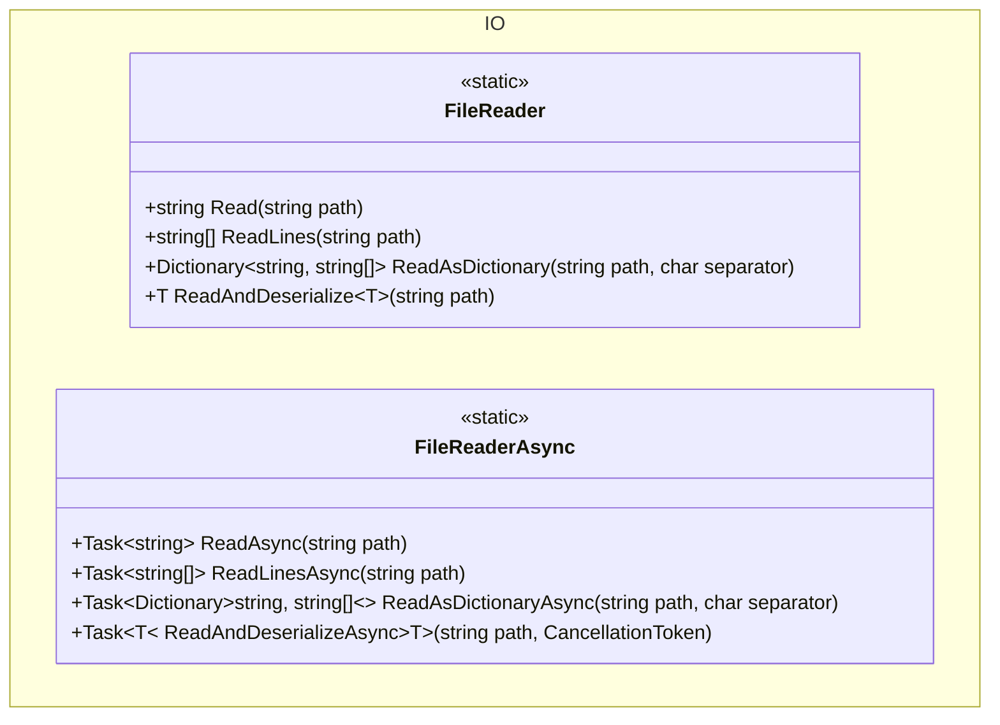

## Features

- `FileReader` (synchronous): read a file as a string, as an array of lines, as a separator-delimited dictionary, or deserialize its JSON content into a typed object. Deserialization throws `JsonException` for an empty, malformed or mismatched payload, and returns `null` only for the JSON literal `null`.
- `FileReaderAsync` (asynchronous): the same four operations as `FileReader`, returning `Task`-wrapped results and accepting a `CancellationToken`. Behavior is identical to the synchronous reader.
- The delimited reader is a plain split on the separator, not an RFC 4180 parser: quoting is not interpreted, so a quoted field containing the separator or a line break is split like any other. It throws `InvalidOperationException` on a duplicate header name rather than silently dropping the column.

## Class Diagram



## Usage

### Synchronous

```csharp
using ArturRios.Util.IO;

// Entire file as a single string
string content = FileReader.Read("/data/notes.txt");

// Array of lines
string[] lines = FileReader.ReadLines("/data/notes.txt");

// Separator-delimited file → dictionary
// Key = first column value, Value = remaining columns as string[]
Dictionary<string, string[]> table = FileReader.ReadAsDictionary("/data/config.csv", ',');

// JSON file → typed object (uses System.Text.Json)
AppConfig config = FileReader.ReadAndDeserialize<AppConfig>("/data/config.json");
```

### Asynchronous

```csharp
using ArturRios.Util.IO;

string content = await FileReaderAsync.ReadAsync("/data/notes.txt");

string[] lines = await FileReaderAsync.ReadLinesAsync("/data/notes.txt");

Dictionary<string, string[]> table =
    await FileReaderAsync.ReadAsDictionaryAsync("/data/config.csv", ',');

AppConfig config =
    await FileReaderAsync.ReadAndDeserializeAsync<AppConfig>("/data/config.json");
```
