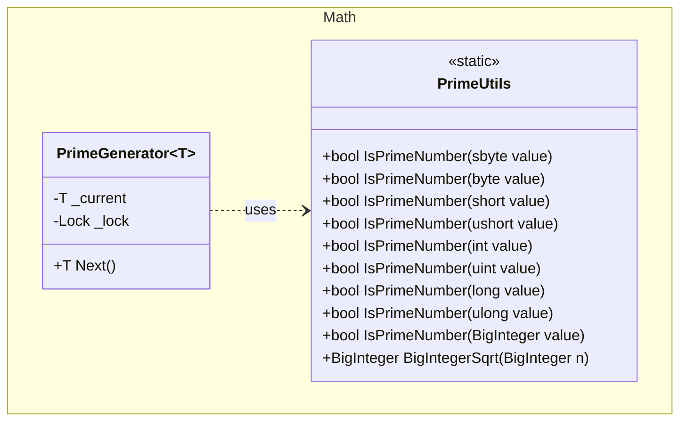

## Features

- `PrimeUtils`: static primality tests for all standard integer types (`sbyte`, `byte`, `short`, `ushort`, `int`, `uint`, `long`, `ulong`) and `BigInteger`. Uses trial division for 32-bit values and deterministic Miller-Rabin witnesses for 64-bit values. Also exposes `BigIntegerSqrt` for computing the integer (floor) square root of a `BigInteger`.
- `PrimeGenerator<T>`: generates an ascending, infinite sequence of prime numbers of the chosen integer type. Thread-safe; each instance maintains its own independent counter. Supported types: `sbyte`, `byte`, `short`, `ushort`, `int`, `uint`, `long`, `ulong`, `BigInteger`.

## Class Diagram



## Usage

### Primality checks

```csharp
using ArturRios.Util.Math;

bool a = PrimeUtils.IsPrimeNumber(7919);                  // true
bool b = PrimeUtils.IsPrimeNumber(7920);                  // false
bool c = PrimeUtils.IsPrimeNumber(1_000_000_007);         // true
bool d = PrimeUtils.IsPrimeNumber(9_223_372_036_854_775_783L); // true (near long.MaxValue)
bool e = PrimeUtils.IsPrimeNumber(new BigInteger(999983));// true
```

### Generating primes in sequence

```csharp
using ArturRios.Util.Math;

var generator = new PrimeGenerator<int>();

Console.WriteLine(generator.Next()); // 2
Console.WriteLine(generator.Next()); // 3
Console.WriteLine(generator.Next()); // 5
Console.WriteLine(generator.Next()); // 7
```

### Using other integer types

```csharp
// byte — sequence ends when next prime would exceed 255
var byteGen = new PrimeGenerator<byte>();
byte first = byteGen.Next(); // 2

// BigInteger — unbounded
var bigGen = new PrimeGenerator<BigInteger>();
BigInteger p = bigGen.Next(); // 2
```

### Integer square root

```csharp
BigInteger root  = PrimeUtils.BigIntegerSqrt(new BigInteger(99));  // 9  (floor)
BigInteger exact = PrimeUtils.BigIntegerSqrt(new BigInteger(100)); // 10 (exact)
```

### Thread-safe independent generators

```csharp
var g1 = new PrimeGenerator<int>();
var g2 = new PrimeGenerator<int>();

g1.Next(); // 2
g1.Next(); // 3

g2.Next(); // 2  ← independent — starts from the beginning
g2.Next(); // 3
```
