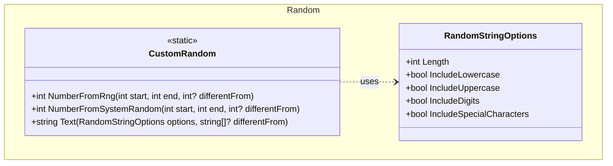

## Features

- `CustomRandom`: static class for generating random integers via cryptographic RNG or `System.Random`, and constrained random strings.
- `RandomStringOptions`: configuration for random string generation — controls length and which character sets to include (lowercase letters, uppercase letters, digits, special characters). **Every flag defaults to `true`**, so disabling a set means setting it to `false` explicitly.

`CustomRandom.Text` draws from `RandomNumberGenerator`, so its output is suitable for security tokens. It guarantees that:

- every character comes from one of the enabled character sets — and only those;
- at least one character from each enabled set is present;
- the result is exactly `Length` characters long.

## Class Diagram



## Usage

### Random integers

```csharp
using ArturRios.Util.Random;

// Cryptographic RNG — unpredictable, preferred for security-sensitive values
int n1 = CustomRandom.NumberFromRng(1, 100);

// System.Random — faster, sufficient for non-security uses
int n2 = CustomRandom.NumberFromSystemRandom(0, 50);

// Exclude a specific value (retries until a different value is produced)
int roll = CustomRandom.NumberFromRng(1, 6, differentFrom: 3); // never returns 3
```

### Random strings

```csharp
using ArturRios.Util.Random;

// 16-character password with all character sets
var pwd = CustomRandom.Text(new RandomStringOptions
{
    Length                  = 16,
    IncludeLowercase        = true,
    IncludeUppercase        = true,
    IncludeDigits           = true,
    IncludeSpecialCharacters = true
});

// 6-digit PIN — the sets you do not want must be disabled explicitly,
// since every flag defaults to true
var pin = CustomRandom.Text(new RandomStringOptions
{
    Length                   = 6,
    IncludeDigits            = true,
    IncludeLowercase         = false,
    IncludeUppercase         = false,
    IncludeSpecialCharacters = false
});

// URL-safe token: letters and digits only, no special characters
var token = CustomRandom.Text(new RandomStringOptions
{
    Length                   = 48,
    IncludeLowercase         = true,
    IncludeUppercase         = true,
    IncludeDigits            = true,
    IncludeSpecialCharacters = false
});

// Avoid previously generated values (e.g., prevent session ID collisions)
var sessionId = CustomRandom.Text(
    new RandomStringOptions
    {
        Length                   = 32,
        IncludeLowercase         = true,
        IncludeUppercase         = false,
        IncludeDigits            = true,
        IncludeSpecialCharacters = false
    },
    differentFrom: existingTokens);
```

### Errors

`CustomRandom.Text` throws `ArgumentException` when the request cannot be satisfied:

```csharp
// No character set enabled — there is nothing to draw from
CustomRandom.Text(new RandomStringOptions
{
    Length                   = 10,
    IncludeLowercase         = false,
    IncludeUppercase         = false,
    IncludeDigits            = false,
    IncludeSpecialCharacters = false
});

// Length smaller than the number of enabled sets — the exact length and the
// at-least-one-of-each guarantee cannot both be honoured
CustomRandom.Text(new RandomStringOptions { Length = 3 }); // 4 sets enabled by default
```
