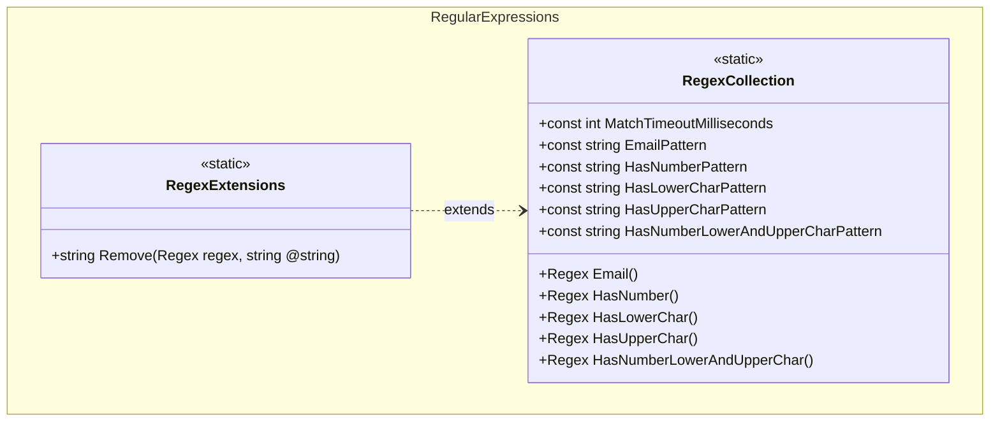

## Features

- `RegexCollection`: source-generated compiled regex methods for common patterns — email address, contains a digit, contains a lowercase letter, contains an uppercase letter, contains all three (digit + lowercase + uppercase).
- `RegexExtensions`: `Remove` extension method on `Regex` that strips all pattern matches from a string.

Every pattern is ASCII only, anchored with `\z` where it is anchored at all, and compiled with a
`MatchTimeoutMilliseconds` ceiling so no input can make a match run unbounded. For faster character class
checks, results that name which requirement failed, or email normalization, see [Text](../text/).

## Class Diagram



## Usage

### Matching

```csharp
using ArturRios.Util.RegularExpressions;

bool isEmail  = RegexCollection.Email().IsMatch("john@doe.com"); // true
bool isEmail2 = RegexCollection.Email().IsMatch("not-an-email"); // false

bool hasDigit = RegexCollection.HasNumber().IsMatch("abc123");   // true
bool hasLower = RegexCollection.HasLowerChar().IsMatch("Hello"); // true
bool hasUpper = RegexCollection.HasUpperChar().IsMatch("Hello"); // true

// Check password complexity in a single call
bool isComplex = RegexCollection.HasNumberLowerAndUpperChar().IsMatch("Password1"); // true
```

`EmailPattern` accepts a single address only. Display names, comments, groups and comma-separated lists are
rejected by design, as are non-ASCII local parts and unbracketed IP hosts — an address literal must be written
`user@[192.168.1.1]`. To accept an internationalized domain, normalize the address first with
`EmailAddress.TryNormalize`.

### Removing matches

```csharp
using ArturRios.Util.RegularExpressions;

// Strip all digits from a string
string lettersOnly = RegexCollection.HasNumber().Remove("abc123def456"); // "abcdef"

// Strip all lowercase letters
string noLower = RegexCollection.HasLowerChar().Remove("Hello World"); // "H W"
```
