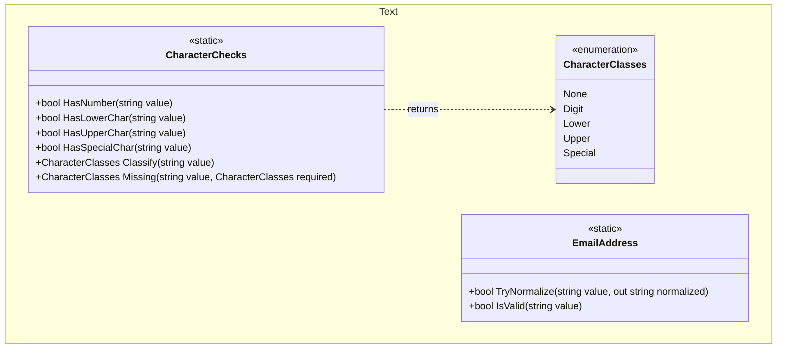

## Features

- `CharacterChecks`: vectorized `SearchValues`-backed checks for digits, lowercase, uppercase and special characters over `string` and `ReadOnlySpan<char>`, plus `Classify` and `Missing` for reporting which character classes a value contains.
- `CharacterClasses`: `[Flags]` enum naming the ASCII character classes — `Digit`, `Lower`, `Upper`, `Special`.
- `EmailAddress`: `TryNormalize` and `IsValid`, which canonicalize an address (lowercased domain, punycoded internationalized domain) before validating it with `RegexCollection.EmailPattern`.

These are alternatives to the patterns in [Regular Expressions](../regular-expressions/), not replacements: the
regexes remain supported and unchanged in behavior.

## Class Diagram



Every `CharacterChecks` method has a `ReadOnlySpan<char>` overload alongside the `string` one shown above.

## Usage

### Character class checks

```csharp
using ArturRios.Util.Text;

bool hasDigit   = "abc123".HasNumber();      // true
bool hasLower   = "Hello".HasLowerChar();    // true
bool hasUpper   = "Hello".HasUpperChar();    // true
bool hasSpecial = "Hello!".HasSpecialChar(); // true

// null is treated as containing nothing rather than throwing
string? missing = null;
bool none = missing.HasNumber();             // false
```

### Reporting which requirements failed

`Missing` returns the required classes that are absent, which is what a validation message actually needs:

```csharp
using ArturRios.Util.Text;

var required = CharacterClasses.Digit | CharacterClasses.Lower |
               CharacterClasses.Upper | CharacterClasses.Special;

var missing = "ab1".Missing(required); // Upper | Special

if (missing != CharacterClasses.None)
{
    Console.WriteLine($"Password still needs: {missing}"); // "Password still needs: Upper, Special"
}

// Classify reports what is present, in a single pass over the input
var present = "aB1".Classify(); // Digit | Lower | Upper
```

### Email normalization

```csharp
using ArturRios.Util.Text;

EmailAddress.TryNormalize("MA@Hostname.COM", out var normalized);
// true, normalized == "MA@hostname.com"

EmailAddress.TryNormalize("ma@münchen.de", out var punycoded);
// true, punycoded == "ma@xn--mnchen-3ya.de"

bool valid = EmailAddress.IsValid("ma@hostname.museum"); // true
```

Normalize before storing or comparing addresses, so two spellings of one mailbox compare equal.

## Choosing between these and the regexes

| Need | Use |
| --- | --- |
| Check a character class, hot path | `CharacterChecks` — about 5x faster than the equivalent regex |
| Know *which* requirements a value failed | `CharacterChecks.Missing` |
| Validate input that may span multiple lines | `CharacterChecks.Classify` |
| Compare or store an email address | `EmailAddress.TryNormalize` |
| Accept an internationalized domain | `EmailAddress.IsValid` |
| A pattern to compose into a larger regex | `RegexCollection` constants |
| Strip matches from a string | `RegexCollection` + `RegexExtensions.Remove` |

### Notes on behavior

- The checks are **ASCII only**, matching the regexes exactly. They deliberately avoid `char.IsDigit` and
  `char.IsLower`, which are Unicode-aware and would report the Arabic-Indic digit three as a digit and the
  German sharp s as a lowercase letter. `Any(char.IsDigit)` is also about twice as slow as the regex.
- `CharacterChecks.Classify` tolerates newlines. `RegexCollection.HasNumberLowerAndUpperChar()` does not,
  because `.` does not match a newline.
- `EmailAddress` does not use `System.Net.Mail.MailAddress`, which is a parser rather than a validator and
  accepts a great deal the pattern rejects, including `user@-hostname.com` and `user@hostname.`.
- `TryNormalize` does not trim surrounding whitespace: an address with stray spaces is rejected rather than
  silently repaired.
