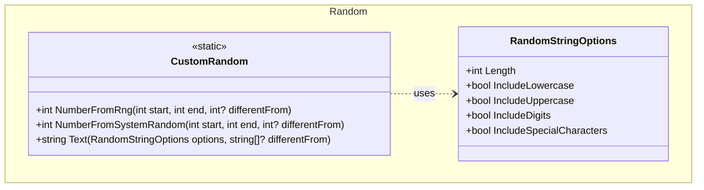

+++
title          = "Random"
show_nav       = true
nav_back_label = "Math"
nav_back_url   = "/dotnet-util/math"
nav_next_label = "Regular Expressions"
nav_next_url   = "/dotnet-util/regular-expressions"
+++

## Features

- `CustomRandom`: static class for generating random integers via cryptographic RNG or `System.Random`, and constrained random strings.
- `RandomStringOptions`: configuration for random string generation — controls length and which character sets to include (lowercase letters, uppercase letters, digits, special characters).

## Class Diagram



## Usage

### Random integers

```csharp
using ArturRios.Util.Random;

// Cryptographic RNG — unpredictable, preferred for security-sensitive values
int n1 = CustomRandom.NumberFromRng(1, 100);

// System.Random — faster, sufficient for non-security uses
int n2 = CustomRandom.NumberFromSystemRandom(0, 50);

// Exclude a specific value (retries until a different value is produced)
int roll = CustomRandom.NumberFromRng(1, 6, differentFrom: 3); // never returns 3
```

### Random strings

```csharp
using ArturRios.Util.Random;

// 16-character password with all character sets
var pwd = CustomRandom.Text(new RandomStringOptions
{
    Length                  = 16,
    IncludeLowercase        = true,
    IncludeUppercase        = true,
    IncludeDigits           = true,
    IncludeSpecialCharacters = true
});

// 6-digit PIN
var pin = CustomRandom.Text(new RandomStringOptions
{
    Length        = 6,
    IncludeDigits = true
});

// Avoid previously generated values (e.g., prevent session ID collisions)
var token = CustomRandom.Text(
    new RandomStringOptions { Length = 32, IncludeDigits = true, IncludeLowercase = true },
    differentFrom: existingTokens);
```
