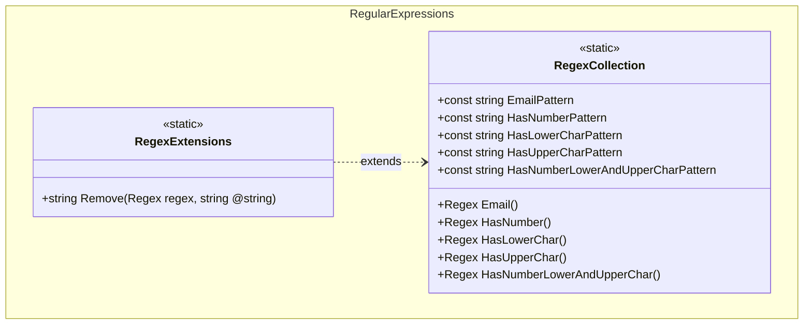

+++
title          = "Regular Expressions"
show_nav       = true
nav_back_label = "Random"
nav_back_url   = "/dotnet-util/random"
+++

## Features

- `RegexCollection`: source-generated compiled regex methods for common patterns — email address, contains a digit, contains a lowercase letter, contains an uppercase letter, contains all three (digit + lowercase + uppercase).
- `RegexExtensions`: `Remove` extension method on `Regex` that strips all pattern matches from a string.

## Class Diagram



## Usage

### Matching

```csharp
using ArturRios.Util.RegularExpressions;

bool isEmail  = RegexCollection.Email().IsMatch("john@doe.com"); // true
bool isEmail2 = RegexCollection.Email().IsMatch("not-an-email"); // false

bool hasDigit = RegexCollection.HasNumber().IsMatch("abc123");   // true
bool hasLower = RegexCollection.HasLowerChar().IsMatch("Hello"); // true
bool hasUpper = RegexCollection.HasUpperChar().IsMatch("Hello"); // true

// Check password complexity in a single call
bool isComplex = RegexCollection.HasNumberLowerAndUpperChar().IsMatch("Password1"); // true
```

### Removing matches

```csharp
using ArturRios.Util.RegularExpressions;

// Strip all digits from a string
string lettersOnly = RegexCollection.HasNumber().Remove("abc123def456"); // "abcdef"

// Strip all lowercase letters
string noLower = RegexCollection.HasLowerChar().Remove("Hello World"); // "H W"
```
