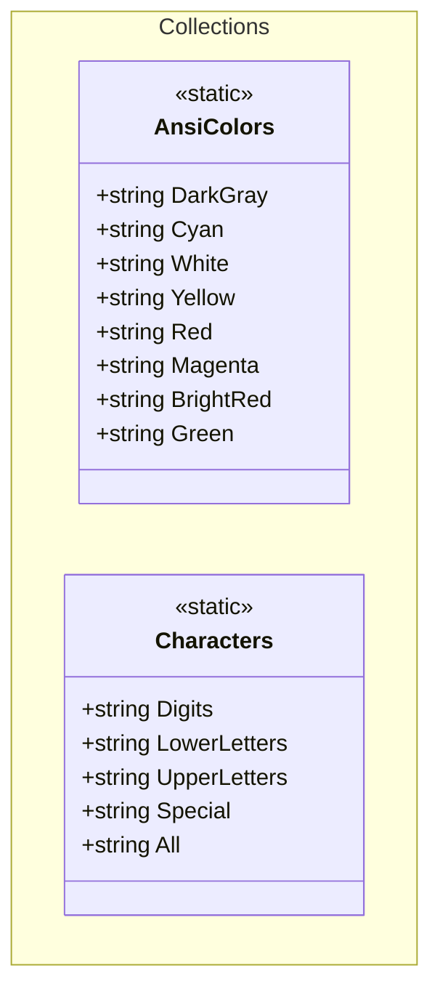
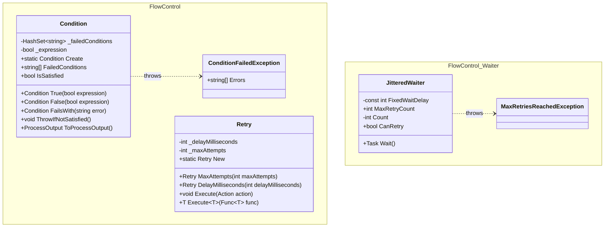
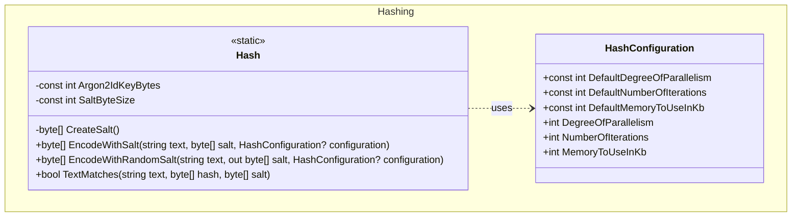
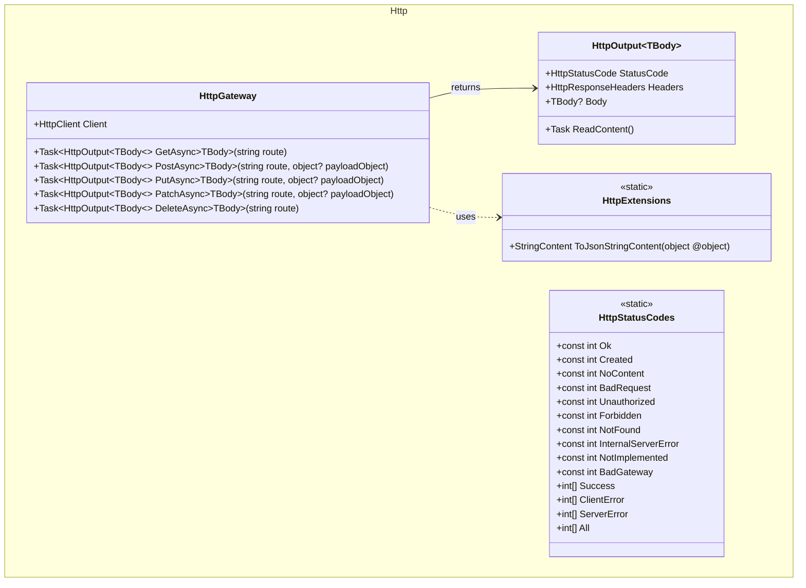
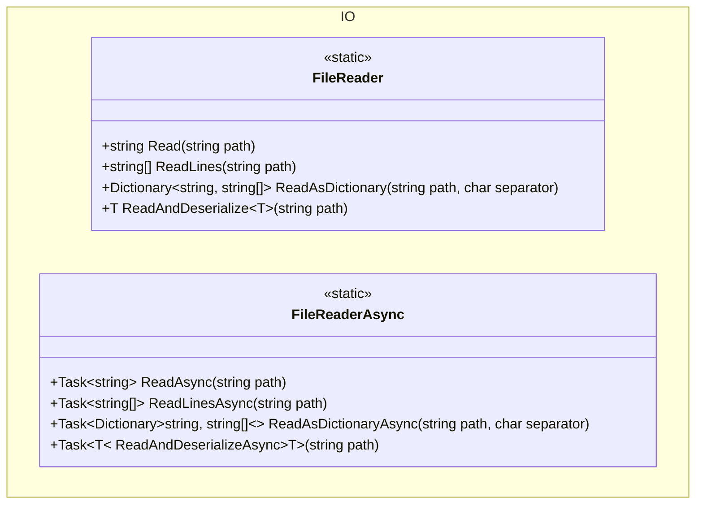
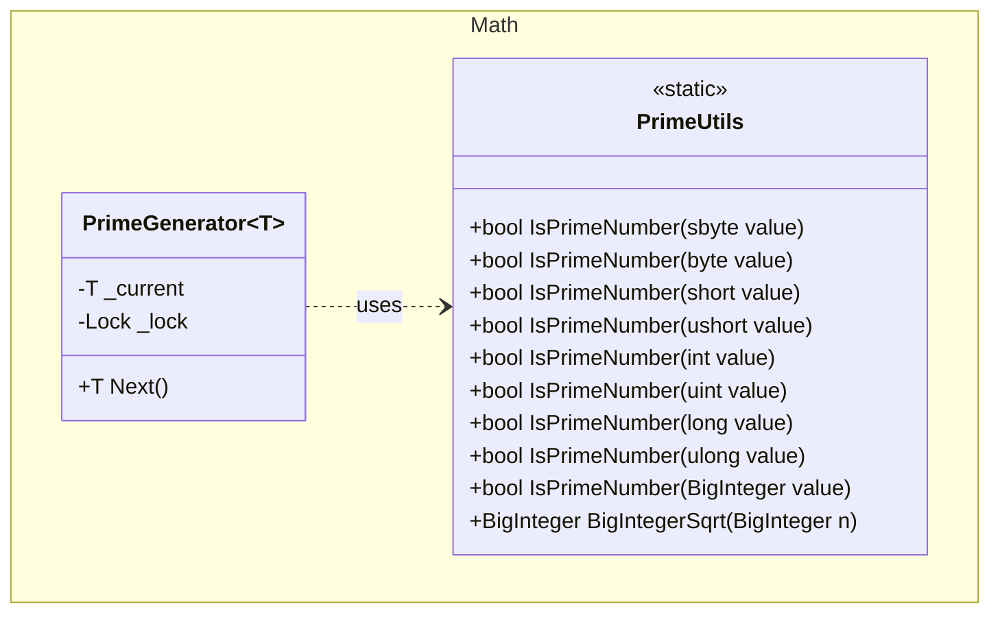
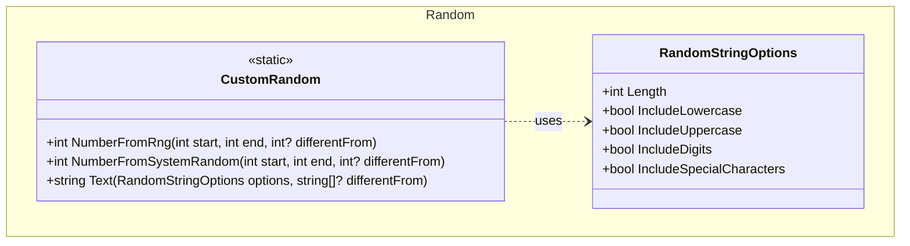
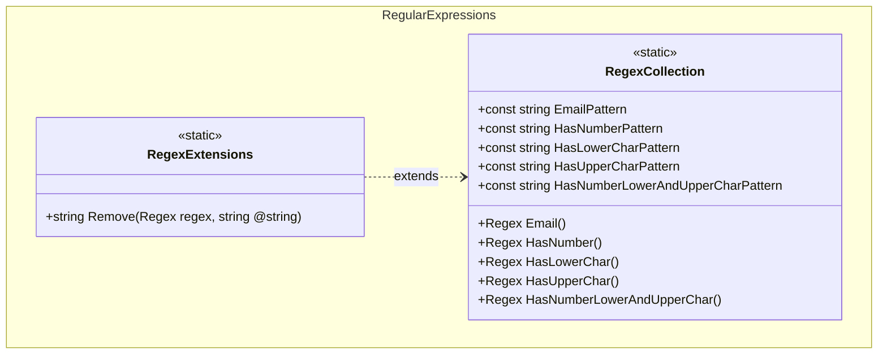

# Documentation Redesign Implementation Plan

> **For agentic workers:** REQUIRED SUB-SKILL: Use superpowers:subagent-driven-development (recommended) or superpowers:executing-plans to implement this plan task-by-task. Steps use checkbox (`- [ ]`) syntax for tracking.

**Goal:** Split the monolithic README into per-module Hugo documentation pages, keeping README and `docs/content/_index.md` in sync as the entry point.

**Architecture:** Each source folder under `src/` gets a dedicated Hugo content page at `docs/content/<slug>.md` with `+++` TOML front matter, a Mermaid class diagram, features list, and usage examples. README and `_index.md` are slimmed down to overview + quickstart + links. No new root-level files; no commits (user commits manually).

**Tech Stack:** Hugo static site, `hugo-theme-re-terminal`, Mermaid diagrams embedded in Markdown, C# code snippets.

## Global Constraints

- No commits — user will commit manually after reviewing all changes.
- Per-module docs live exclusively in `docs/content/` — no new root-level markdown files.
- Hugo base URL: `https://artur-rios.github.io/dotnet-util/`
- Navigation order (alphabetical by folder): Collections → Flow Control → Hashing → Http → IO → Math → Random → Regular Expressions.
- Front matter uses `+++` TOML delimiters (not YAML `---`).
- `_index.md` keeps title-only front matter — no nav fields.
- Last page (`regular-expressions.md`) omits `nav_next_label` / `nav_next_url`.

---

### Task 1: Update README.md

**Files:**
- Modify: `README.md`

**Interfaces:**
- Produces: entry-point document; all 8 module quickstart snippets; Documentation section with links to `https://artur-rios.github.io/dotnet-util/<slug>/`

- [ ] **Step 1: Replace README.md with the updated content**

Replace the entire file with:

```markdown
# Dotnet Util

Utilities for common development tasks in .NET: flow control (conditions, retries, and waiters), hashing (Argon2id), file I/O helpers, HTTP client helpers, math utilities, random values and strings, regex helpers, and small collections.

## Installation

- NuGet (recommended): publish or consume the package when available.
  - Package ID: `ArturRios.Util`.
  - dotnet CLI: `dotnet add package ArturRios.Util`
  - Or reference locally:
    ```xml
    <ItemGroup>
      <ProjectReference Include="..\src\ArturRios.Util.csproj" />
    </ItemGroup>
    ```

## Quickstart

- **Collections**
  ```csharp
  using ArturRios.Util.Collections;
  Console.WriteLine($"{AnsiColors.Green}Success!\x1b[0m");
  var pool = Characters.Digits + Characters.UpperLetters;
  ```

- **FlowControl**
  ```csharp
  using ArturRios.Util.FlowControl;
  using ArturRios.Util.FlowControl.Waiter;

  Condition.Create
    .True(user is not null).FailsWith("User is required")
    .True(emailValid).FailsWith("Invalid email")
    .ThrowIfNotSatisfied();

  Retry.New.MaxAttempts(3).DelayMilliseconds(200).Execute(() => DoFragileWork());
  var result = Retry.New.MaxAttempts(5).Execute(() => Compute());

  var waiter = new JitteredWaiter(maxRetryCount: 5);
  while (waiter.CanRetry)
  {
      try { await TryOperationAsync(); break; }
      catch { await waiter.Wait(); }
  }
  ```

- **Hashing**
  ```csharp
  using ArturRios.Util.Hashing;
  var hash = Hash.EncodeWithRandomSalt("secret", out var salt);
  var ok = Hash.TextMatches("secret", hash, salt);
  ```

- **Http**
  ```csharp
  using ArturRios.Util.Http;
  var gateway = new HttpGateway(httpClient);
  var output = await gateway.GetAsync<MyResponse>("/api/items");
  if ((int)output.StatusCode == HttpStatusCodes.Ok)
      Console.WriteLine(output.Body);
  ```

- **IO**
  ```csharp
  using ArturRios.Util.IO;
  var text  = FileReader.Read(path);
  var lines = FileReader.ReadLines(path);
  var dict  = FileReader.ReadAsDictionary(path, ',');
  var obj   = FileReader.ReadAndDeserialize<MyType>(jsonPath);
  // Async variants available on FileReaderAsync
  ```

- **Math**
  ```csharp
  using ArturRios.Util.Math;
  bool isPrime = PrimeUtils.IsPrimeNumber(7919); // true
  var generator = new PrimeGenerator<int>();
  Console.WriteLine(generator.Next()); // 2
  Console.WriteLine(generator.Next()); // 3
  ```

- **Random**
  ```csharp
  using ArturRios.Util.Random;
  var n   = CustomRandom.NumberFromRng(1, 10);
  var n2  = CustomRandom.NumberFromSystemRandom(0, 100, differentFrom: 42);
  var pwd = CustomRandom.Text(new RandomStringOptions { Length = 16, IncludeSpecialCharacters = true });
  ```

- **RegularExpressions**
  ```csharp
  using ArturRios.Util.RegularExpressions;
  var isEmail = RegexCollection.Email().IsMatch("john@doe.com");
  var stripped = RegexCollection.HasNumber().Remove("abc123def"); // "abcdef"
  ```

## Documentation

Full API reference, class diagrams, and usage examples:

- [Collections](https://artur-rios.github.io/dotnet-util/collections/)
- [Flow Control](https://artur-rios.github.io/dotnet-util/flow-control/)
- [Hashing](https://artur-rios.github.io/dotnet-util/hashing/)
- [Http](https://artur-rios.github.io/dotnet-util/http/)
- [IO](https://artur-rios.github.io/dotnet-util/io/)
- [Math](https://artur-rios.github.io/dotnet-util/math/)
- [Random](https://artur-rios.github.io/dotnet-util/random/)
- [Regular Expressions](https://artur-rios.github.io/dotnet-util/regular-expressions/)

## Contributing

Tests live under `tests/ArturRios.Util.Tests`. Please add tests for new features and run them before submitting PRs. Follow typical .NET coding conventions and keep public APIs documented with XML comments.

## Legal Details

This project is licensed under the [MIT License](https://en.wikipedia.org/wiki/MIT_License). A copy of the license is available at [LICENSE](./LICENSE) in the repository.
```

- [ ] **Step 2: Verify**

Open `README.md` and confirm:
- All 8 modules appear in Quickstart (Collections, FlowControl, Hashing, Http, IO, Math, Random, RegularExpressions).
- Documentation section has 8 links pointing to `https://artur-rios.github.io/dotnet-util/<slug>/`.
- No leftover per-module detail sections (class diagrams, full feature lists) remain.

---

### Task 2: Update docs/content/_index.md

**Files:**
- Modify: `docs/content/_index.md`

**Interfaces:**
- Consumes: same body content as README (Task 1)
- Produces: Hugo home page; body identical to README except Documentation links use site-relative paths

- [ ] **Step 1: Replace _index.md with the updated content**

Replace the entire file with:

```markdown
+++
title = 'Dotnet Util'
+++

# Dotnet Util

Utilities for common development tasks in .NET: flow control (conditions, retries, and waiters), hashing (Argon2id), file I/O helpers, HTTP client helpers, math utilities, random values and strings, regex helpers, and small collections.

## Installation

- NuGet (recommended): publish or consume the package when available.
  - Package ID: `ArturRios.Util`.
  - dotnet CLI: `dotnet add package ArturRios.Util`
  - Or reference locally:

    ```xml
    <ItemGroup>
      <ProjectReference Include="..\src\ArturRios.Util.csproj" />
    </ItemGroup>
    ```

## Quickstart

- **Collections**

  ```csharp
  using ArturRios.Util.Collections;
  Console.WriteLine($"{AnsiColors.Green}Success!\x1b[0m");
  var pool = Characters.Digits + Characters.UpperLetters;
  ```

- **FlowControl**

  ```csharp
  using ArturRios.Util.FlowControl;
  using ArturRios.Util.FlowControl.Waiter;

  Condition.Create
    .True(user is not null).FailsWith("User is required")
    .True(emailValid).FailsWith("Invalid email")
    .ThrowIfNotSatisfied();

  Retry.New.MaxAttempts(3).DelayMilliseconds(200).Execute(() => DoFragileWork());
  var result = Retry.New.MaxAttempts(5).Execute(() => Compute());

  var waiter = new JitteredWaiter(maxRetryCount: 5);
  while (waiter.CanRetry)
  {
      try { await TryOperationAsync(); break; }
      catch { await waiter.Wait(); }
  }
  ```

- **Hashing**

  ```csharp
  using ArturRios.Util.Hashing;
  var hash = Hash.EncodeWithRandomSalt("secret", out var salt);
  var ok = Hash.TextMatches("secret", hash, salt);
  ```

- **Http**

  ```csharp
  using ArturRios.Util.Http;
  var gateway = new HttpGateway(httpClient);
  var output = await gateway.GetAsync<MyResponse>("/api/items");
  if ((int)output.StatusCode == HttpStatusCodes.Ok)
      Console.WriteLine(output.Body);
  ```

- **IO**

  ```csharp
  using ArturRios.Util.IO;
  var text  = FileReader.Read(path);
  var lines = FileReader.ReadLines(path);
  var dict  = FileReader.ReadAsDictionary(path, ',');
  var obj   = FileReader.ReadAndDeserialize<MyType>(jsonPath);
  // Async variants available on FileReaderAsync
  ```

- **Math**

  ```csharp
  using ArturRios.Util.Math;
  bool isPrime = PrimeUtils.IsPrimeNumber(7919); // true
  var generator = new PrimeGenerator<int>();
  Console.WriteLine(generator.Next()); // 2
  Console.WriteLine(generator.Next()); // 3
  ```

- **Random**

  ```csharp
  using ArturRios.Util.Random;
  var n   = CustomRandom.NumberFromRng(1, 10);
  var n2  = CustomRandom.NumberFromSystemRandom(0, 100, differentFrom: 42);
  var pwd = CustomRandom.Text(new RandomStringOptions { Length = 16, IncludeSpecialCharacters = true });
  ```

- **RegularExpressions**

  ```csharp
  using ArturRios.Util.RegularExpressions;
  var isEmail  = RegexCollection.Email().IsMatch("john@doe.com");
  var stripped = RegexCollection.HasNumber().Remove("abc123def"); // "abcdef"
  ```

## Documentation

Full API reference, class diagrams, and usage examples:

- [Collections](/dotnet-util/collections/)
- [Flow Control](/dotnet-util/flow-control/)
- [Hashing](/dotnet-util/hashing/)
- [Http](/dotnet-util/http/)
- [IO](/dotnet-util/io/)
- [Math](/dotnet-util/math/)
- [Random](/dotnet-util/random/)
- [Regular Expressions](/dotnet-util/regular-expressions/)

## Contributing

Tests live under `tests/ArturRios.Util.Tests`. Please add tests for new features and run them before submitting PRs. Follow typical .NET coding conventions and keep public APIs documented with XML comments.

## Legal Details

This project is licensed under the [MIT License](https://en.wikipedia.org/wiki/MIT_License). A copy of the license is available at [LICENSE](https://github.com/artur-rios/dotnet-util/blob/main/LICENSE).
```

- [ ] **Step 2: Verify**

Confirm:
- Front matter is `+++` TOML with `title = 'Dotnet Util'` only (no nav fields).
- Documentation links use site-relative paths (`/dotnet-util/collections/` etc.), not absolute URLs.
- Body content matches README.md (Task 1) except for the link format difference above.

---

### Task 3: Create docs/content/collections.md

**Files:**
- Create: `docs/content/collections.md`

**Interfaces:**
- Produces: Hugo page at `/dotnet-util/collections/`; nav back to Home, next to Flow Control

- [ ] **Step 1: Create the file**

```markdown
+++
title          = "Collections"
show_nav       = true
nav_back_label = "Home"
nav_back_url   = "/dotnet-util"
nav_next_label = "Flow Control"
nav_next_url   = "/dotnet-util/flow-control"
+++

## Features

- `AnsiColors`: static class with ANSI escape code string constants for console foreground colors (DarkGray, Cyan, White, Yellow, Red, Magenta, BrightRed, Green).
- `Characters`: static class with string constants for character pools — digits, lowercase letters, uppercase letters, special characters, and the union `All`.

## Class Diagram



## Usage

### ANSI Colors

Wrap text in a color constant and reset with `\x1b[0m`:

```csharp
using ArturRios.Util.Collections;

Console.WriteLine($"{AnsiColors.Green}Success!\x1b[0m");
Console.WriteLine($"{AnsiColors.Red}Error: something went wrong.\x1b[0m");
Console.WriteLine($"{AnsiColors.Yellow}Warning: disk usage is high.\x1b[0m");
Console.WriteLine($"{AnsiColors.Cyan}Info: process started.\x1b[0m");
```

### Character Pools

Combine pools with string concatenation:

```csharp
using ArturRios.Util.Collections;

string alphanumeric = Characters.Digits + Characters.LowerLetters + Characters.UpperLetters;
bool isDigit = Characters.Digits.Contains('5'); // true

// Use Characters.All for the widest possible pool
string fullPool = Characters.All;
```
```

- [ ] **Step 2: Verify**

Confirm front matter block opens and closes with `+++`, `nav_back_url = "/dotnet-util"`, `nav_next_url = "/dotnet-util/flow-control"`, and both Mermaid and csharp code fences are properly closed.

---

### Task 4: Create docs/content/flow-control.md

**Files:**
- Create: `docs/content/flow-control.md`

**Interfaces:**
- Produces: Hugo page at `/dotnet-util/flow-control/`; nav back to Collections, next to Hashing

- [ ] **Step 1: Create the file**

```markdown
+++
title          = "Flow Control"
show_nav       = true
nav_back_label = "Collections"
nav_back_url   = "/dotnet-util/collections"
nav_next_label = "Hashing"
nav_next_url   = "/dotnet-util/hashing"
+++

## Features

- `Condition`: fluent condition aggregator; collects failure messages and can throw `ConditionFailedException` or convert to a process output.
- `ConditionFailedException`: exception carrying all collected error messages as `string[]`.
- `Retry`: simple retry with configurable max attempts and fixed delay; supports `Action` and `Func<T>`.
- `JitteredWaiter`: exponential backoff with jitter; exposes `CanRetry` and throws `MaxRetriesReachedException` when retries are exhausted.
- `MaxRetriesReachedException`: exception thrown when `JitteredWaiter` exceeds its retry limit.

## Class Diagram



## Usage

### Condition

Chain boolean assertions — all failures are collected before throwing:

```csharp
using ArturRios.Util.FlowControl;

Condition.Create
    .True(user is not null).FailsWith("User is required")
    .True(emailValid).FailsWith("Invalid email format")
    .False(string.IsNullOrEmpty(username)).FailsWith("Username cannot be empty")
    .ThrowIfNotSatisfied();
```

Convert to a process output instead of throwing:

```csharp
var result = Condition.Create
    .True(age >= 18).FailsWith("Must be 18 or older")
    .ToProcessOutput();

if (!result.Success)
    Console.WriteLine(string.Join(", ", result.Errors));
```

### Retry

Retry a void action:

```csharp
using ArturRios.Util.FlowControl;

Retry.New
    .MaxAttempts(3)
    .DelayMilliseconds(200)
    .Execute(() => SendEmail(recipient));
```

Retry a function that returns a value:

```csharp
var data = Retry.New
    .MaxAttempts(5)
    .DelayMilliseconds(500)
    .Execute(() => FetchDataFromApi());
```

### JitteredWaiter

Use in a polling or retry loop with exponential backoff:

```csharp
using ArturRios.Util.FlowControl.Waiter;

var waiter = new JitteredWaiter(maxRetryCount: 5);

while (waiter.CanRetry)
{
    try
    {
        await TryOperationAsync();
        break;
    }
    catch (TransientException)
    {
        await waiter.Wait();
    }
}
```
```

- [ ] **Step 2: Verify**

Confirm `nav_back_url = "/dotnet-util/collections"`, `nav_next_url = "/dotnet-util/hashing"`, and all three usage sections (Condition, Retry, JitteredWaiter) are present with closed code fences.

---

### Task 5: Create docs/content/hashing.md

**Files:**
- Create: `docs/content/hashing.md`

**Interfaces:**
- Produces: Hugo page at `/dotnet-util/hashing/`; nav back to Flow Control, next to Http

- [ ] **Step 1: Create the file**

```markdown
+++
title          = "Hashing"
show_nav       = true
nav_back_label = "Flow Control"
nav_back_url   = "/dotnet-util/flow-control"
nav_next_label = "Http"
nav_next_url   = "/dotnet-util/http"
+++

## Features

- `Hash`: static helpers for Argon2id password hashing — encode with a provided or randomly generated salt, and verify plaintext against a stored hash.
- `HashConfiguration`: configures Argon2id cost parameters — degree of parallelism, number of iterations, and memory usage in KB. Ships with sensible defaults.

## Class Diagram



## Usage

### Hash a password with a random salt

```csharp
using ArturRios.Util.Hashing;

// Encode — store both hash and salt
byte[] hash = Hash.EncodeWithRandomSalt("my-secret-password", out byte[] salt);

// Verify later
bool matches = Hash.TextMatches("my-secret-password", hash, salt); // true
bool wrong   = Hash.TextMatches("wrong-password",     hash, salt); // false
```

### Hash with a known salt

```csharp
byte[] salt = GetSaltFromStorage();
byte[] hash = Hash.EncodeWithSalt("my-secret-password", salt);
```

### Custom cost parameters

```csharp
var config = new HashConfiguration
{
    DegreeOfParallelism = 4,
    NumberOfIterations  = 3,
    MemoryToUseInKb     = 65536
};

byte[] hash = Hash.EncodeWithRandomSalt("my-secret-password", out byte[] salt, config);
```
```

- [ ] **Step 2: Verify**

Confirm `nav_back_url = "/dotnet-util/flow-control"`, `nav_next_url = "/dotnet-util/http"`, and three usage examples are present with closed code fences.

---

### Task 6: Create docs/content/http.md

**Files:**
- Create: `docs/content/http.md`

**Interfaces:**
- Produces: Hugo page at `/dotnet-util/http/`; nav back to Hashing, next to IO

- [ ] **Step 1: Create the file**

```markdown
+++
title          = "Http"
show_nav       = true
nav_back_label = "Hashing"
nav_back_url   = "/dotnet-util/hashing"
nav_next_label = "IO"
nav_next_url   = "/dotnet-util/io"
+++

## Features

- `HttpGateway`: wraps `HttpClient` with typed async methods for GET, POST, PUT, PATCH, and DELETE. Each method deserializes the response body into the specified type and returns an `HttpOutput<TBody>`.
- `HttpOutput<TBody>`: typed HTTP response container carrying the status code, response headers, and deserialized body.
- `HttpExtensions`: extension on `object` providing `ToJsonStringContent()` to serialize any object into a `StringContent` suitable for request payloads.
- `HttpStatusCodes`: static constants for common HTTP status codes (200, 201, 204, 400, 401, 403, 404, 500, 501, 502) plus grouped collections (`Success`, `ClientError`, `ServerError`, `All`).

## Class Diagram



## Usage

### Basic GET request

```csharp
using ArturRios.Util.Http;

var client  = new HttpClient { BaseAddress = new Uri("https://api.example.com") };
var gateway = new HttpGateway(client);

var output = await gateway.GetAsync<List<Product>>("/products");

if ((int)output.StatusCode == HttpStatusCodes.Ok)
{
    foreach (var product in output.Body!)
        Console.WriteLine(product.Name);
}
```

### POST with a payload

```csharp
var newProduct = new { Name = "Widget", Price = 9.99 };

var output = await gateway.PostAsync<Product>("/products", newProduct);

if ((int)output.StatusCode == HttpStatusCodes.Created)
    Console.WriteLine($"Created: {output.Body!.Id}");
```

### PUT and PATCH

```csharp
var update = new { Name = "Updated Widget" };

await gateway.PutAsync<Product>("/products/42", update);
await gateway.PatchAsync<Product>("/products/42", update);
```

### DELETE

```csharp
var output = await gateway.DeleteAsync<object>("/products/42");

if ((int)output.StatusCode == HttpStatusCodes.NoContent)
    Console.WriteLine("Deleted.");
```

### Status code groups

```csharp
int code = (int)output.StatusCode;

if (HttpStatusCodes.Success.Contains(code))
    Console.WriteLine("Request succeeded.");
else if (HttpStatusCodes.ClientError.Contains(code))
    Console.WriteLine("Client error — check your request.");
else if (HttpStatusCodes.ServerError.Contains(code))
    Console.WriteLine("Server error — try again later.");
```

### Serialize a payload manually

```csharp
var payload = new UpdateRequest { Name = "New Name" };
StringContent content = payload.ToJsonStringContent();
// UTF-8, application/json
```
```

- [ ] **Step 2: Verify**

Confirm `nav_back_url = "/dotnet-util/hashing"`, `nav_next_url = "/dotnet-util/io"`, all five HTTP verb usage examples are present, and all code fences are closed.

---

### Task 7: Create docs/content/io.md

**Files:**
- Create: `docs/content/io.md`

**Interfaces:**
- Produces: Hugo page at `/dotnet-util/io/`; nav back to Http, next to Math

- [ ] **Step 1: Create the file**

```markdown
+++
title          = "IO"
show_nav       = true
nav_back_label = "Http"
nav_back_url   = "/dotnet-util/http"
nav_next_label = "Math"
nav_next_url   = "/dotnet-util/math"
+++

## Features

- `FileReader` (synchronous): read a file as a string, as an array of lines, as a separator-delimited dictionary, or deserialize its JSON content into a typed object.
- `FileReaderAsync` (asynchronous): the same four operations as `FileReader`, returning `Task`-wrapped results.

## Class Diagram



## Usage

### Synchronous

```csharp
using ArturRios.Util.IO;

// Entire file as a single string
string content = FileReader.Read("/data/notes.txt");

// Array of lines
string[] lines = FileReader.ReadLines("/data/notes.txt");

// Separator-delimited file → dictionary
// Key = first column value, Value = remaining columns as string[]
Dictionary<string, string[]> table = FileReader.ReadAsDictionary("/data/config.csv", ',');

// JSON file → typed object (uses Newtonsoft.Json)
AppConfig config = FileReader.ReadAndDeserialize<AppConfig>("/data/config.json");
```

### Asynchronous

```csharp
using ArturRios.Util.IO;

string content = await FileReaderAsync.ReadAsync("/data/notes.txt");

string[] lines = await FileReaderAsync.ReadLinesAsync("/data/notes.txt");

Dictionary<string, string[]> table =
    await FileReaderAsync.ReadAsDictionaryAsync("/data/config.csv", ',');

AppConfig config =
    await FileReaderAsync.ReadAndDeserializeAsync<AppConfig>("/data/config.json");
```
```

- [ ] **Step 2: Verify**

Confirm `nav_back_url = "/dotnet-util/http"`, `nav_next_url = "/dotnet-util/math"`, both sync and async usage sections are present, and all code fences are closed.

---

### Task 8: Create docs/content/math.md

**Files:**
- Create: `docs/content/math.md`

**Interfaces:**
- Produces: Hugo page at `/dotnet-util/math/`; nav back to IO, next to Random

- [ ] **Step 1: Create the file**

```markdown
+++
title          = "Math"
show_nav       = true
nav_back_label = "IO"
nav_back_url   = "/dotnet-util/io"
nav_next_label = "Random"
nav_next_url   = "/dotnet-util/random"
+++

## Features

- `PrimeUtils`: static primality tests for all standard integer types (`sbyte`, `byte`, `short`, `ushort`, `int`, `uint`, `long`, `ulong`) and `BigInteger`. Uses trial division for 32-bit values and deterministic Miller-Rabin witnesses for 64-bit values. Also exposes `BigIntegerSqrt` for computing the integer (floor) square root of a `BigInteger`.
- `PrimeGenerator<T>`: generates an ascending, infinite sequence of prime numbers of the chosen integer type. Thread-safe; each instance maintains its own independent counter. Supported types: `sbyte`, `byte`, `short`, `ushort`, `int`, `uint`, `long`, `ulong`, `BigInteger`.

## Class Diagram



## Usage

### Primality checks

```csharp
using ArturRios.Util.Math;

bool a = PrimeUtils.IsPrimeNumber(7919);                  // true
bool b = PrimeUtils.IsPrimeNumber(7920);                  // false
bool c = PrimeUtils.IsPrimeNumber(1_000_000_007);         // true
bool d = PrimeUtils.IsPrimeNumber(9_223_372_036_854_775_783L); // true (near long.MaxValue)
bool e = PrimeUtils.IsPrimeNumber(new BigInteger(999983));// true
```

### Generating primes in sequence

```csharp
using ArturRios.Util.Math;

var generator = new PrimeGenerator<int>();

Console.WriteLine(generator.Next()); // 2
Console.WriteLine(generator.Next()); // 3
Console.WriteLine(generator.Next()); // 5
Console.WriteLine(generator.Next()); // 7
```

### Using other integer types

```csharp
// byte — sequence ends when next prime would exceed 255
var byteGen = new PrimeGenerator<byte>();
byte first = byteGen.Next(); // 2

// BigInteger — unbounded
var bigGen = new PrimeGenerator<BigInteger>();
BigInteger p = bigGen.Next(); // 2
```

### Integer square root

```csharp
BigInteger root  = PrimeUtils.BigIntegerSqrt(new BigInteger(99));  // 9  (floor)
BigInteger exact = PrimeUtils.BigIntegerSqrt(new BigInteger(100)); // 10 (exact)
```

### Thread-safe independent generators

```csharp
var g1 = new PrimeGenerator<int>();
var g2 = new PrimeGenerator<int>();

g1.Next(); // 2
g1.Next(); // 3

g2.Next(); // 2  ← independent — starts from the beginning
g2.Next(); // 3
```
```

- [ ] **Step 2: Verify**

Confirm `nav_back_url = "/dotnet-util/io"`, `nav_next_url = "/dotnet-util/random"`, five usage sections are present, and all code fences are closed.

---

### Task 9: Create docs/content/random.md

**Files:**
- Create: `docs/content/random.md`

**Interfaces:**
- Produces: Hugo page at `/dotnet-util/random/`; nav back to Math, next to Regular Expressions

- [ ] **Step 1: Create the file**

```markdown
+++
title          = "Random"
show_nav       = true
nav_back_label = "Math"
nav_back_url   = "/dotnet-util/math"
nav_next_label = "Regular Expressions"
nav_next_url   = "/dotnet-util/regular-expressions"
+++

## Features

- `CustomRandom`: static class for generating random integers via cryptographic RNG or `System.Random`, and constrained random strings.
- `RandomStringOptions`: configuration for random string generation — controls length and which character sets to include (lowercase letters, uppercase letters, digits, special characters).

## Class Diagram



## Usage

### Random integers

```csharp
using ArturRios.Util.Random;

// Cryptographic RNG — unpredictable, preferred for security-sensitive values
int n1 = CustomRandom.NumberFromRng(1, 100);

// System.Random — faster, sufficient for non-security uses
int n2 = CustomRandom.NumberFromSystemRandom(0, 50);

// Exclude a specific value (retries until a different value is produced)
int roll = CustomRandom.NumberFromRng(1, 6, differentFrom: 3); // never returns 3
```

### Random strings

```csharp
using ArturRios.Util.Random;

// 16-character password with all character sets
var pwd = CustomRandom.Text(new RandomStringOptions
{
    Length                  = 16,
    IncludeLowercase        = true,
    IncludeUppercase        = true,
    IncludeDigits           = true,
    IncludeSpecialCharacters = true
});

// 6-digit PIN
var pin = CustomRandom.Text(new RandomStringOptions
{
    Length        = 6,
    IncludeDigits = true
});

// Avoid previously generated values (e.g., prevent session ID collisions)
var token = CustomRandom.Text(
    new RandomStringOptions { Length = 32, IncludeDigits = true, IncludeLowercase = true },
    differentFrom: existingTokens);
```
```

- [ ] **Step 2: Verify**

Confirm `nav_back_url = "/dotnet-util/math"`, `nav_next_url = "/dotnet-util/regular-expressions"`, both usage sections are present, and all code fences are closed.

---

### Task 10: Create docs/content/regular-expressions.md

**Files:**
- Create: `docs/content/regular-expressions.md`

**Interfaces:**
- Produces: Hugo page at `/dotnet-util/regular-expressions/`; nav back to Random; **no nav_next** (last page)

- [ ] **Step 1: Create the file**

```markdown
+++
title          = "Regular Expressions"
show_nav       = true
nav_back_label = "Random"
nav_back_url   = "/dotnet-util/random"
+++

## Features

- `RegexCollection`: source-generated compiled regex methods for common patterns — email address, contains a digit, contains a lowercase letter, contains an uppercase letter, contains all three (digit + lowercase + uppercase).
- `RegexExtensions`: `Remove` extension method on `Regex` that strips all pattern matches from a string.

## Class Diagram



## Usage

### Matching

```csharp
using ArturRios.Util.RegularExpressions;

bool isEmail  = RegexCollection.Email().IsMatch("john@doe.com"); // true
bool isEmail2 = RegexCollection.Email().IsMatch("not-an-email"); // false

bool hasDigit = RegexCollection.HasNumber().IsMatch("abc123");   // true
bool hasLower = RegexCollection.HasLowerChar().IsMatch("Hello"); // true
bool hasUpper = RegexCollection.HasUpperChar().IsMatch("Hello"); // true

// Check password complexity in a single call
bool isComplex = RegexCollection.HasNumberLowerAndUpperChar().IsMatch("Password1"); // true
```

### Removing matches

```csharp
using ArturRios.Util.RegularExpressions;

// Strip all digits from a string
string lettersOnly = RegexCollection.HasNumber().Remove("abc123def456"); // "abcdef"

// Strip all lowercase letters
string noLower = RegexCollection.HasLowerChar().Remove("Hello World"); // "H W"
```
```

- [ ] **Step 2: Verify**

Confirm `nav_back_url = "/dotnet-util/random"`, **no** `nav_next_label` or `nav_next_url` fields in front matter, both usage sections are present, and all code fences are closed.
